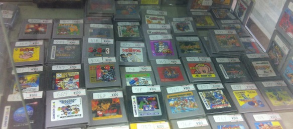
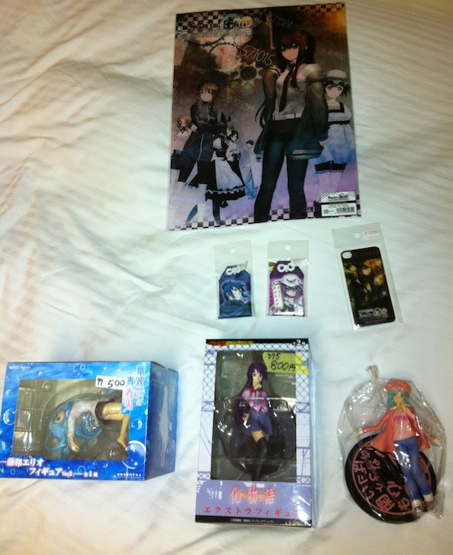

There was one sole gole today: go to Akihabara and buy buy buy!

---

First of I'd like to say, that after spending a whole day in Akiba, I have come to the realization that it is greatly overrated! Sure it has huge anime and electronics shops, but it isn't as grand as was expected. My imagination of Akiba was this huge road with anime shops on both sides and arcades. Well i got exactly that, but not as big as initially thought. Because I have spent 4 months in Osaka and in its anime/tech district Nipponbashi, I expected Akiba to be three times the size. It is a bit bigger than Nipponbashi, I do accept that, but for all the hype that is around it... you can just go to Nipponbashi and get the same stuff, and with less people in your way (less gaijin too).

I could have spent 200$ today, but money doesn't grow on trees. I managed to scoop up some very nice stuff though!

- Denpa Onna (Erio) fig for 500円
- Bakemonogatari (Sengoku) fig for 400円
- 2 omamori charms for 700円 each
- a huge Steins;Gate poster for 400円
- and a Bakemonogatari (Senjogahara) fig (present) for my good friend [Ruben](http://rubenerd.com) for 800円

Pic:

Full album here:

