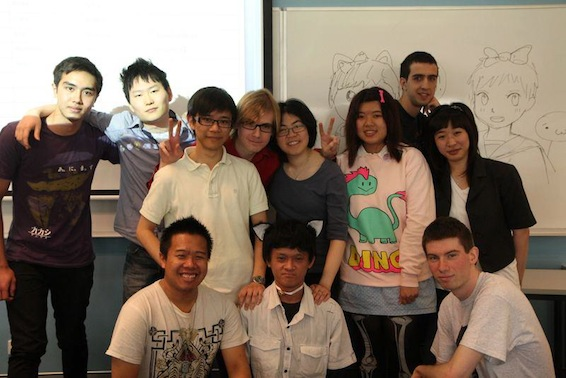

Yesterday, 29th of September was the day of the UTS Anime clubs Annual General Meeting. There we discussed the events of this year and plans for the future. But the main event was the election of the new executive team.

First of we thanked the 2011-12 execs for all their hard work. And then we proceeded to elect the new team.

I wanted to go for two positions: Events manager and Screenings coordinator, and so I did. However apparently one person can only have one position, so therefore during the events coordinator elections, I was shot down. But then I was nominated for screenings director by everyone and everyone seconded it and so thats how everyone elected me as screenings director /shock XD

Overall the whole exec team changed (except for Mr. Prez and Kiri). We will make this year even more fun!

Full story on the [Anime@UTS website](http://utsanime.net/2012/09/agm-2012-results/)
