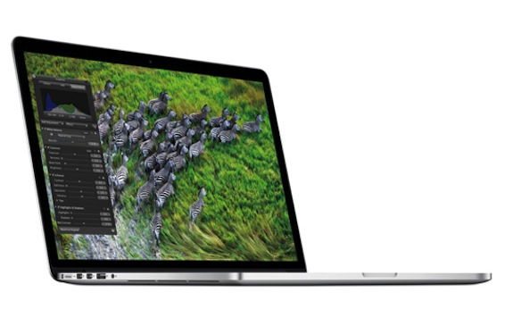
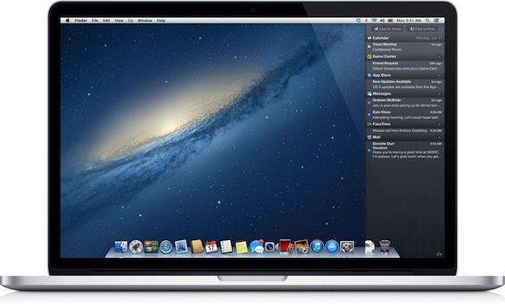
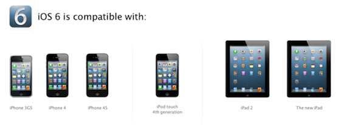
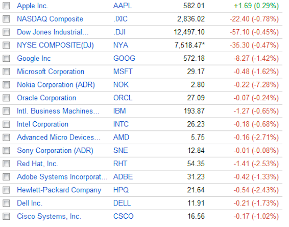

This is a little late. I was a bit busy these days with playing CoD and SSFIV:AE2012.

So anyway, on to the Keynote:

generally it was a little bit less than what i expected, but it was nevertheless exciting and had a ton of new stuff.

**First of all: [the new MacBook Pro with Retina Display](http://www.apple.com/macbook-pro/)**

---Specs:

- Its got a 2880-by-1800 pixel screen, thats the highest resolution EVER on a laptop
- 2.3GHz quad-core Intel Core i7 processor
- 8GB of RAM
- 256GB of Flash storage
- and it is tiny! Height: 1.8 cm Width:35.89 cm Weight: 2.02 kg

Personal opinion: it is just awesome! BUT if you need such a high performance machine. This laptop will be useful to designers and such, but not to uni students/teachers or just simple businessmen.

Price: **A$ 2,499.00** (Ouch!)

**Second: OSX Mountain Lion:** 

heaps of new features, which i personally can't wait:

- Reminders
- Notes
- Messages
- Notification Centre
- Twitter/Facebook Sharing
- Dictation
- PowerNap
- AirPlay
- GameCenter (nobody cares about game center....)
- and a better Safari

A very nice update, bringing OSX one step closer to iOS.

***And last: [iOS 6](http://www.apple.com/au/ios/ios6/ 'iOS6'):*** 

- Better Siri
- New Maps (goodbye Google Maps)
- Facebook integration (same as twitter)
- Shared Photo Streams
- FaceTime over 3G
- better Safari
- Do not Disturb switch
- useless Passbook

not that exiting, but hey, and update is an update

 

Also while me and [David](http://twitter.com/valtism) were watching the Keynote live, he sent me this interesting screenshot, which I found rather funny:

