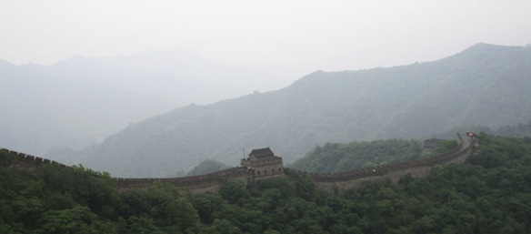
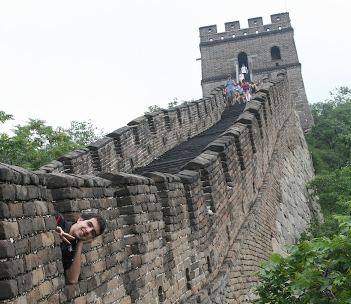
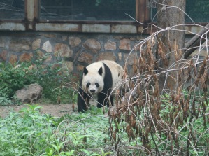

**DAY 3:**

As a man of the Nights Watch, it is my duty to protect The Wall from everything that lies north. That is why I was given the mission of going up on top of The Wall.

The Great Wall of China! I architecture marvel, if I do say so myself. To get up there we had to take a cable car up into the mountains.

<!--more-->

The one disappointment was the weather, thru ought the whole trip it was cloudy and at times it rained heavily. On the other hand though, if it was sunny, we would have most likely died of the heat, cause it is summer after all...

We only had an hour or so on the wall, so my dad and me, we just ran off and started taking pictures of everything XD

The reason there is no sun is because Winter is Coming!!

Also they had some awesome panda hats on sale there (Look at the pics in the gallery at the end of this post)

 

**DAY 4:**

Plan for the day:

- go to zoo
- look at panda
- ????
- profit

Beijing Zoo! To get there, we took the subway. WOW the subway system in Beijing is soooo neat and tidy. I was very impressed, I even thing that the trains themselves are better than the ones in Japan. They had screens with maps and all the stations were announced in Chinese and Engrish.

So anyway, we got to the zoo and went straight to the pandas. And what do you think.... they have all eaten their lunch and are now sound asleep....... So all we got to see were some butts of sleeping pandas... But luckily there was this one panda who was still moving and I managed to capture his face.

There were bunch of other animals around, and we got some pics of them as well.

After the zoo, we went for lunch and I challenged myself and ordered some MapoTofu! I managed half of the plate, and almost died doing that. Now I understand why [Tachibana Kanade](http://myanimelist.net/anime/6547/Angel_Beats! 'Angel Beats') loved this stuff, its delicious once you get used to the taste of burn in your mouth.

That concludes my adventures in Beijing. Next up is Xi'an. We took a train to Xi'an from Beijing West Station. Now that is what I call a crowd, never seen so my any people at a station in my life.

Photo Album:

