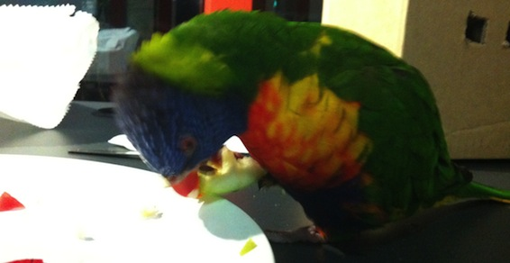

Ever since I started living in Australia, I had some pretty cool/crazy stuff happen to me, but nothing compared to what went down yesterday. Imagine this, my friend Maria comes back from work at 6pm, opens her door (she lives on the 15th floor) and sees a **[Rainbow Lorikeet](http://en.wikipedia.org/wiki/Rainbow_Lorikeet)** flying in her room.

---

 She freaks out and calls urba**nest** (place where we live) reception, and reception calls me. This lorikeet flew into her open window sometime during the day and stayed there until she came back. The bird was very friendly, it loved sitting on our shoulders and was very tame. We called the [RSPCA](http://www.rspca.org.au) (organisation that provides shelter for animals) and asked them what to do. They advised us to drop him of at one of their locations on Sunday (the next day). So we were stuck with him for the night....

We decided that I would take care of him and leave him in some sort of cage in my kitchen for the night. When we transported him to my room, he just sat there on my shoulder while I was mopping the floor and ironing my clothes. I felt like a pirate, Arrrrghhhh! Then I skyped with some of my friends to show them my awesome pet (for one night) and he just sat there on my shoulder, sometimes moving to the other shoulder. When it was time for bed, we put him under a laundry basket, making it his cage. Of course we gave him some fruit and left hime a bowl of water for the night.

This morning Nishi and Wilmer took him to one of the locations where they take care of animals. So now he is gone. But I did get some pictures:

<iframe src="http://imgur.com/a/eEvHP/embed" height="550" width="100%" frameborder="0"></iframe>
