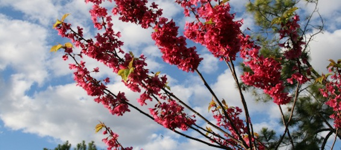
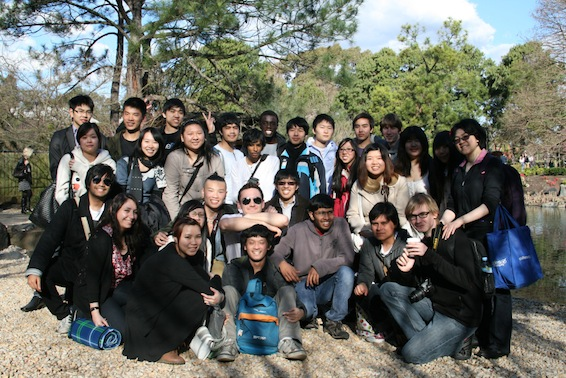

Today me and my friends from Anime@UTS went to see the cherry blossom in Auburn botanical gardens.

---

So everyone got to Auburn station at about 11:30 with a few exceptions, arriving earlier to prepare. We waked to the gardens and BBQ area and started up the whole cooking process at about 12.

We had heaps of snacks and drinks, so everyone was happy. Took a while to make the sausages though.... After lunch we proceeded inside the gardens to look at the actual cherry blossoms and other plants. We also saw a swan and some koi fish.

Group photo:

Without further ado, here is the photo gallery:

