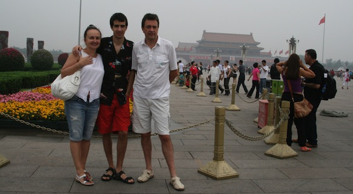
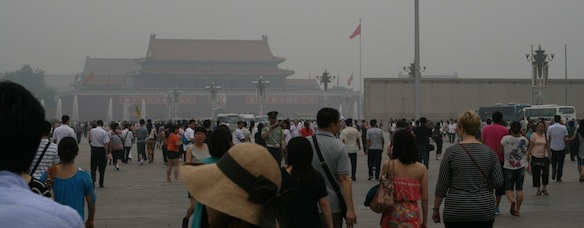
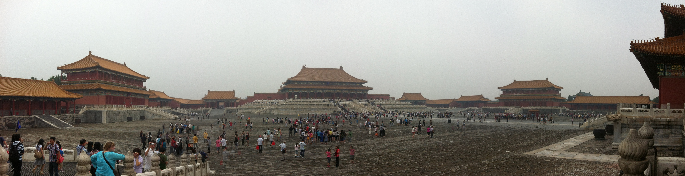
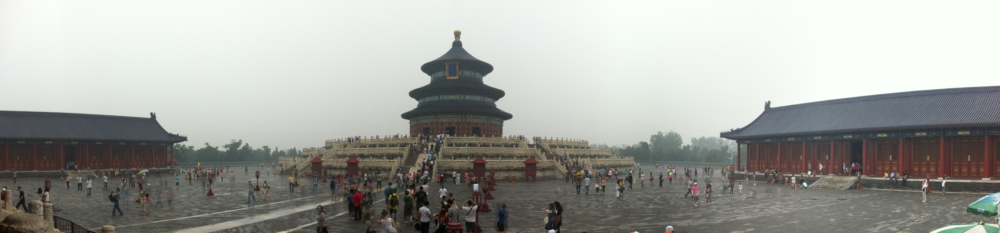

So the plan for day 2 was:

- TianAnMen Square
- The Forbidden City
- The Temple of Heaven
- A visit to a silk factory

A pretty full day. It was rather tiring, but we managed to pull though!

[TianAnMen Squire](http://en.wikipedia.org/wiki/Tiananmen_Square), the biggest square in the world. It is huuuuuuge! I can't image what goes down when half of china is gathered there. There were lots of tourists nevertheless, so it gave a pretty good understanding of the size.

<!--more-->

When we went though the gates with the giant face of [Mao Zedong](http://en.wikipedia.org/wiki/Mao_Zedong) and then went through another set of gates, and then another...

Then we finally reached the [Forbidden City](http://en.wikipedia.org/wiki/Forbidden_City). It is called forbidden, cause in the good old days only the emperor and his closest advisers were allowed in.

This whole forbidden city, emperors, advisers, etc... reminded me a lot of Avatar The Last Airbender. I know that it was heavily based on the Chinese history and stuff, but to be soooo much alike, wow :D

Then we moved on to the [Temple of Heaven](http://en.wikipedia.org/wiki/Temple_of_Heaven). A very beautiful traditional building (temple). What I found very intriguing, is that the outer walls and gate of the temple make a square shape (a square symbolizes the earth in old chinese mythos), but the inner walls and the temple itself is a perfect circle (a circle represents the sky, heaven). It was explained to me, that this was the road from the ground to heaven, and the emperor would walk it to "enlighten" himself once in a while.

After a nice and filling lunch, we went to a silk factory. There we were shown how silk is gathered and what can be made out of it. Rugs, pillows, blankets, sheets, shirts, pants, napkins, scarfs, robes, etc..... That was pretty cool. I decided to put a silk chinese white shirt and pants outfit on, but my mother didn't like it, so i couldn't buy it :( I think she has a grudge against china themed clothes. There were also heaps of chinese dresses (you know, like the ones in anime), so u thought to myself: "Hmmmm i should get one for my girlfriend and make her wear it" But then I realized a small flaw in that sentence.... I don't have a "real" girlfriend.

Oh we also went for a tea ceremony. Ended up buying 300$ worth of tea... But maaaaaan that was some good tea!

I love tea. Photo Album:

