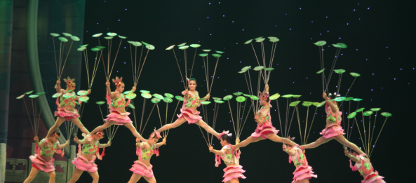
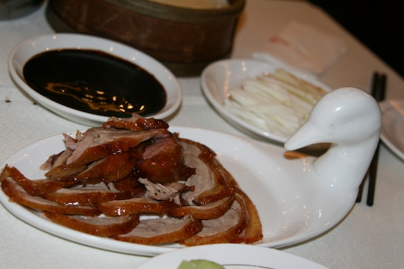

I have already written up a [post about me walking around Beijing](/posts/2012/walking-around-beijing/) during the first day while waiting for my parents. So now, since I have normal internet again, I will continue the story.

---

After meeting my parents and having a lovely reunion, we went for dinner. It was no ordinary dinner, it was a duck; a [Peking duck](http://en.wikipedia.org/wiki/Peking_Duck).

It was delicious. I've tried lots of chinese food while living in Sydney, but never have I tasted anything as wonderful as this duck.

My parents, who have never eaten any chinese food, were very impressed by the variety and delicious taste of the dishes that were served.

After that delicious dinner, we went to a Chinese Acrobat show. My father filmed the whole thing, so here is just a snippet of the one and a half hour long show:

- Part of the hat juggling performance

https://www.youtube.com/watch?v=tv7MJB40W5Y

- Motorbikes in a giant metal ball

https://www.youtube.com/watch?v=CcpotCbkKiw

It is pretty hard to impress me, but WOW! that show was just amazing.

If you guys want to see more of the performance, just let me know and I can upload some more footage.

Meanwhile here are some pics (the whole China 2012 Album):

