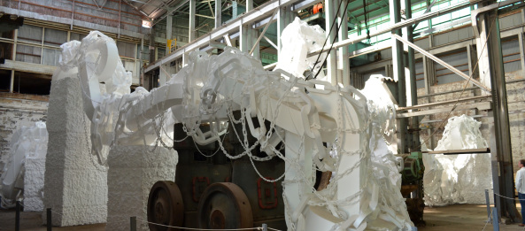

Today me and my good friends from the [Anime@UTS](http://utsanime.net) club, [Sebastian](http://twitter.com/sebasu_tan) and [Gina](http://twitter.com/ginarrrgh), went to Cockatoo island to see the contemporary visual arts exhibition.

<!--more-->The plan was to leave early and finish early to make it to the screening, but unfortunately we didn't manage to catch the first ferry to the island because of the huge number of people that wanted to go there.

When we got there, we were given a map so we diced not to follow its directions and just wandered around the island the whole time. The artworks that were displayed there, were pretty amazing. There was this big piece of machinery with chains on it, but the chains were made out of foam. Then there was this dark room with lights hanging from the ceiling, and when you touch them, or just bring your hand close to them, the lights turn on.  Then there was this place with things dangling from the ceiling. And there was this tunnel with bucket robots which looked like the minions from Despicable Me.

At first the weather was awesome, but then it started pouring. We were very lucky to make it in the boat before it started pouring like crazy.

Overall it was a lot of fun. Thank you Seb and Gina for spending this awesome day with me. Without you guys there, this wouldn't have been such an epic adventure.

Walk -> Boat -> Island -> Walk around -> Boat -> Walk -> Food -> Anime

