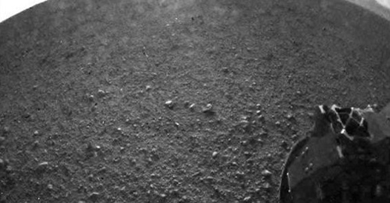
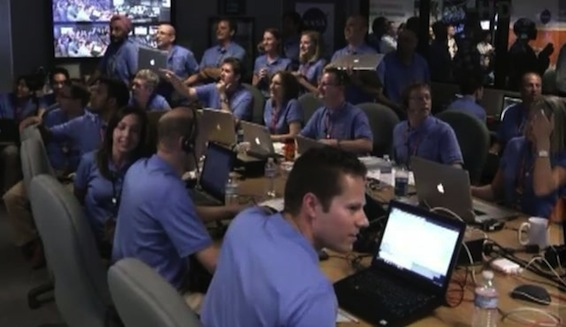
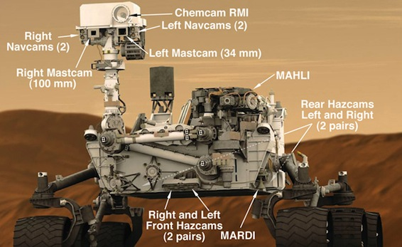

Due to my busy life at uni I wasn't able to post this news when it actually happened, and I apologize for that.

The Nasa Mars rover "Curiosity" has safely landed on mars and has sent us back some pictures.

---

When the whole world is glued to their TVs watching the olympics in London, we geeks were watching the live stream of the Curiosity Mars landing. Unfortunately I didn't get to se the live stream, but I get to see the pictures of the hype that was at Nasa headquarters.

Please note the number of Mac Books in the room..... Take that all you Apple haters!

Here is a picture of the Curiosity Rover and the location of all its cameras. Up until now we have only seen a few images of Mars, and most of them were a bit blurry. This is because the cameras are not yet ready to take good photos.

[Gizmodo has written up an explanation of this.](http://gizmodo.com/5932521/why-do-the-mars-rovers-images-look-so-bad)

Also my friend [Rubenerd](http://rubenerd.com/nasa-curiosity-arrived/) has written up a blog post about this even as well, please visit his blog and take a look.
