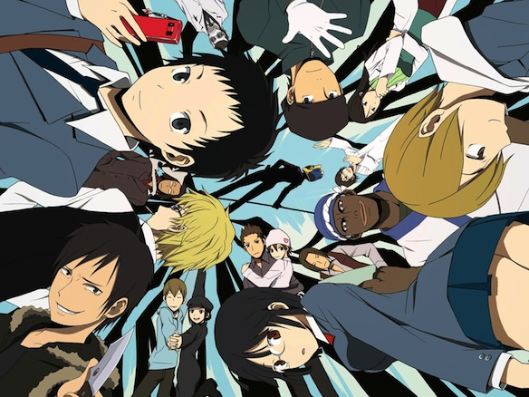
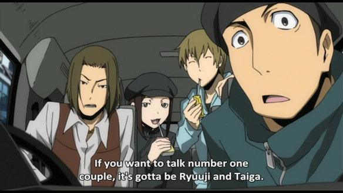

So when i finished watching [Durarara!](http://myanimelist.net/anime.php?id=6746) this February, I wrote up a nice little review of the series on Google+. Well now that I have a blog, I decided to copy it here so that everyone can see.

Review:

3 awesome things about durarara: - the infinite number of awesome characters and their stories - the constant references to other well known anime, which in order to find you need to be very anime knowledgable - the humor

---

By combing the 3, an epic anime is born.

But id still say that the main stand point of Durarara!! are the characters. Starting from high school students, through gang members, russian sushi waiters, money collectors, black market doctors, information dealers, and up to a headless black biker girl with a cutely naive personality. This doesn't even begin to sum up the epicness of the cast. I even felt like I was on the same level as one the characters: Orihara Izaya (the information dealer). I, as the viewer knew what everyone was up to, Izaya controlled the whole story. He manipulated people, gave them the information they needed and set them up in order to progress his game. And his constant struggle with Hiewajima Shizuo, the insanely strong, vending machine throwing dude in the bartender outfit, brought the series the awesome fighting that it needed.

The series was very enjoyable and i'm happy i finished it less then a week and that I noticed a hell lot of references.

At first i thought of giving it a 9, but after watching ep 25 (its like a special extra ep, along with 12.5, and i don't rate them separately) i decided to go with a **10 out of 10**, because of the references and this phrase:

