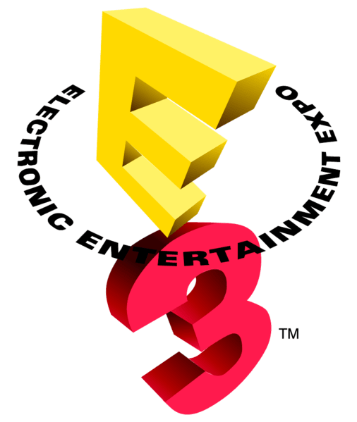

Its this time of year when the nice people over at the E3 gaming convention show us all the new stuff they have in store for us this/next year.

Some of these titles are sequels to previous games and of course there are some new and original games as well

First up is Assassins Creed III:

<iframe src="//www.youtube.com/embed/nL6chDa7T8Q" height="315" width="560" allowfullscreen frameborder="0"></iframe>

Cinematic Trailer

<!--more-->

<iframe src="//www.youtube.com/embed/F2i-dRkPtQA" height="315" width="560" allowfullscreen frameborder="0"></iframe>

Gameplay

This cinematic trailer shows that this new Assassins Creed game does not fall behind the previous titles. In the gameplay vid, we can see better graphics and new fighting system. Also log awaited tree climbing!!!!

Next is South Park:

<iframe src="//www.youtube.com/embed/bkZHv-9e2ro" height="315" width="560" allowfullscreen frameborder="0"></iframe>

Looking exactly like the series, this MMORPG is gonna be epic! Only downside is the release date is set for March 5th 2013......
