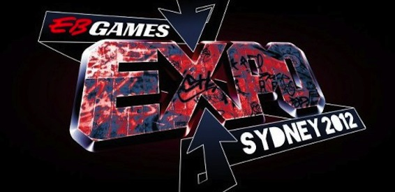
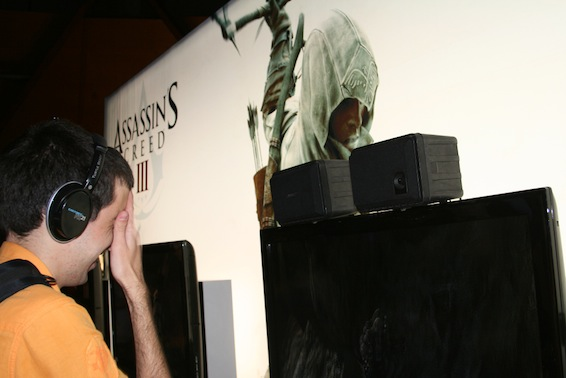
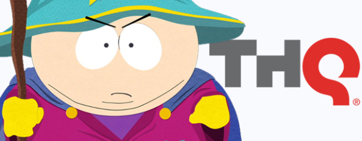
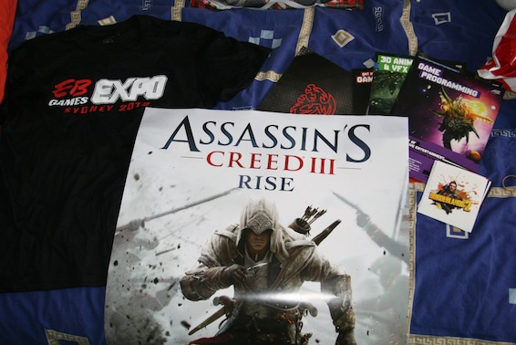

5-7 October is in Sydney Olympic Park there is an event. Not just any event. Its a game exposition! [EB EXPO SYDNEY 2012](http://www.ebexpo.com.au) brought to you by EB Games Australia. My good friend Hussein and I wen there today, for a full day of adventure, fun and new experiences with new, unreleased games.

---

Our journey began at 9am with the CityRail (CityFail) trains arriving with 15 minute delays due to the weather. However that did not stop us from reaching EB Expo! The moment we entered the center both of us were speechless. It was our first time at a game exhibition, and it was truly an unforgettable experience. I wont go into too much detail about all the stuff that was showcased there, but will only mention the ones I care about most.

Assassins Creed III. My most anticipated game of this year. After an hour of waiting in line, we managed to play 1 mission of this stunning new game. Took me a few seconds to remember the controls and to figure out where to go, but apart from that the game felt very nice. I did however manage to bug the game out (was being desynchronized during a cutscene cause I was being detected by the guard even though I was behind a wall). Thanks to that, I got 10 extra minutes to play :D

Facepalm due to me derping by pressing jump while climbing a cliff and dying.

They had some pretty awesome merchandise on sale (most sold out though, some not on sale, just on display). They even had Game of Thrones merch and WoW stuff as well.

But what amazed me the most were the cosplayers. These people have dedication! Some of the costumes I've seen there must have cost at least around 500$ maybe more. The ones I particularly liked were the Assassins Creed ones, TF2 ones, and CoD MW3 guys.

One more thing! There was a booth from THQ:

Thats right! South Park: The Stick of Truth! They did not let us play the game, but they did show us a 10 minute video of the development and the game mechanics. This was done under closed curtains due to age restrictions (Mature 18+ content). It was amazing! It is gonna be one hell of an RPG. With customizable character profile and look, turn by turn combat system and Mr. Slave! (they got heeeeeeaps of references to the shows episodes).

Here is my loot:

Well with that all covered and done, I can say it was one hell of a day; but it was totally worth it! Here are some pics:

