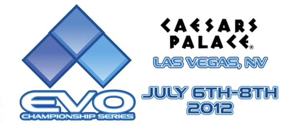

It is that time 0f year, when all of us fighting game fans can rejoice and watch the worlds largest tournament - EVO! Held every year in beginning - mid July at the Caesars Palace in Las Vegas Nevada. This is like the olympics of fighting games! All the greatest players gather there and compete for the title of the worlds greatest fighter. The games that are featured this year are: Super Street Fighter IV: Arcade edition version 2012, Street Fighter X Tekken, Soul Calibur V, King of Fighters XIII, Marvel vs. Capcom 3, and Mortal Kombat 9.

<!--more-->The level of gameplay displayed by these players is amazing! They whip out combos and tricks which were not even imagined to be doable o\_O

Here is a link to [Eventhubs](http://www.eventhubs.com/news/2012/jul/06/evo-2012-results-streams-battle-logs-and-information/) and [Shouryuken](http://shoryuken.com/2012/07/06/evo-2012-is-now-streaming-live/), who are doing a full coverage of the event and they even have some link and embedded live streams.

What is important for me as a Street Fighter fan and player are the results of the SF players, so here they are; these will be the top 8, fighting on Sunday 8pm LasVegas time:

**Winners bracket** - WW|Infiltration vs. MCZ|Daigo - Humanbomb vs. CVPR|PR Balrog

**Losers bracket** - AVM|GamerBee vs. BT|Dieminion - TH|Poongko vs. eLive|Xiaohai

Now all that is left is to w8 until monday (Japanese time) and watch the top 8 battle it out!

PS: here is a vid of Daigo beating GamerBee in the 1/16th:

<iframe src="//www.youtube.com/embed/RAx2aFdaMpw" height="315" width="560" allowfullscreen frameborder="0"></iframe>
