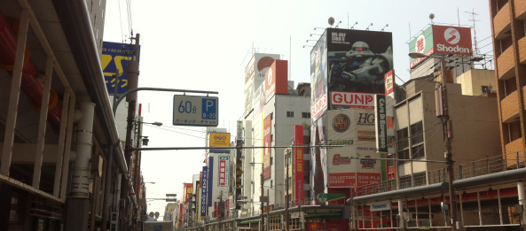

So these are my last few hours in glorious Japan. I will be leaving for the airport shortly.... But before leaving I went to Nipponbashi one last time. Played some Street Fighter, jubeat and most importantly got to see the Yuru Yuri exhibition. Im sure my friend Tac will be so jealous right now. And this is where I bid farewell to the land of Japan and get ready to go to the airport for my 4pm flight to Shanghai and then to Sydney.

The photos of the Yuru Yuri exhibition are somewhere at the bottom:

