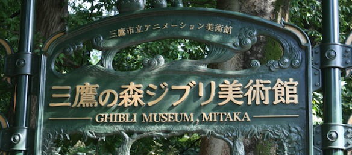
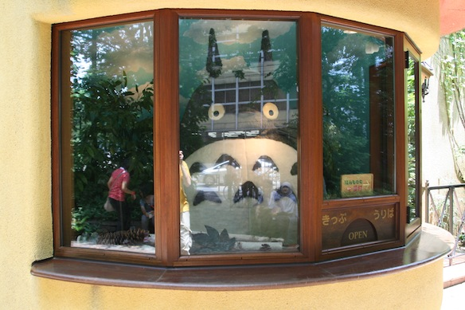
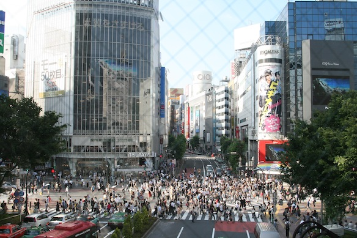

A must visit destination for everyone going to Tokyo!

In the suburb of Tokyo called Mitaka, there is a park (or more like a forest), which is the home for all things Ghibli.

<!--more-->We were greeted at the entrance by Totoro - the receptionist XD

I would like to show you guys more pictures, but unfortunately taking photos inside of the Ghibli Museum was strictly prohibited, therefore I can only tell you what I saw.

First room was an introduction to the world of Ghibli: it had the drawings of each frame from various movies, and it showed how animation is created by skipping through those frames at a high speed. Then there was a room with lots of background art stiles, like from Nausicaa, Princess Mononoke, and Arietty. They even had a life sized doll house which was featured in Arietty. Aside from animation techniques and stuff, there was a cat bus shaped playground for kids, the Laputa robot on the roof, a cafe, and a shop. I bought myself a badge for my bag (I'm collecting badges from all over the place and am putting them on my bag, all because of my good friend [Ruben](http://rubenerd.com) XD) and a small metal figure of the Laputa robot.

Afterwards we had some food in the cafe, and that pretty much sums up the whole day :D

PS: I also ended up in Shibuya, so I took some pics of the famous crossing: 

Here is the photo album:

