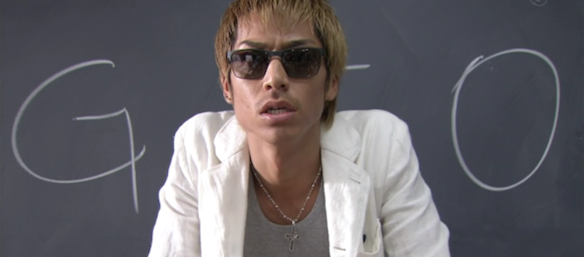

If you are even a bit into japanese TV or animation, you must have heard the tile [Great Teacher Onizuka](http://en.wikipedia.org/wiki/Great_Teacher_Onizuka). It is a world famous series with a manga, which started in 1997, a japanese TV drama (TV series) which was broadcasted in 1998, and then a 43 episode anime which aired in 1999-2000. And now, in the summer of 2012 they have decided to remake the TV drama into a more modern version with a slight change in story. It is being broadcasted all over Japan on Fuji TV every tuesday at 10:15PM (literally its being aired as I am writing this, too bad I don't have a TV set in my room ).

---The first episode came out last week (3rd of July). I downloaded (DLed) it from a very nice [website](http://d-addicts.com/) and watched it on thursday. Although it didn't have any subtitles, I managed to understand 95% of it. Excluding some words which i could make out cause Onizuka was speaking too fast at times, I can proudly say that I understood everything.

Im enjoying it so far, will make a review when it finishes. Everyone who watched the GTO anime/ read the GTO manga/ watched the old drama, should watch this to!

Here is a picture of the main cast (Murai, Onizuka and Fuyutsuki):

