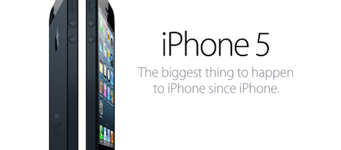

On the night of the 12-13th of September (Australia time) Apple held their iPhone event wher they not only introduced the new iPhone but refreshed the iPod nanos and touches as well.

First let me talk about the [iPhone 5](http://www.apple.com/au/iphone/).

- All new design: taller display, sleek aluminum plate on the back, smaller dock connector
- 4" Retina display
- Ultrafast wireless with 4G LTE technology
- Powerful A6 chip which is twice as fast as the iPhone4S
- Redesigned "EarPods"
- and the worlds most advanced operating system: iOS6

Currently I have the iPhone4 so for me this will be a big spec boost. So I knew I was gonna buy it months before it was announced. My (now) old phone I will give to my dad, cause he currently has some old battered up Samsung.

Now I shall tell you a funny story of how I pre-ordered the iPhone5:

Apple said that pre-orders for the new iPhone will start on the 14th of September. So I waited until midnight but the page didn't allow me to preorder it. Ok, I waited till 1am, still no luck. Went to bed. Woke up at 8am, still no luck. Went back to bed. Woke up at 11am still no luck. Went to class. Was sitting there like an idiot in front of my computer constantly refreshing the website. The finally, the Apple Store site was taken down (which means they are updating it). But that lasted from 1:30pm till 4:40pm. I was waiting waiting waiting and waiting. Then at long last at about 5pm I preordered it from my iPhone4 Apple Store app. And only at about 5:30pm the Apple Store website came back up again.

Hopefully it will arrive on the 21st (friday) like promised, then I get to play with my new toy all weekend.
