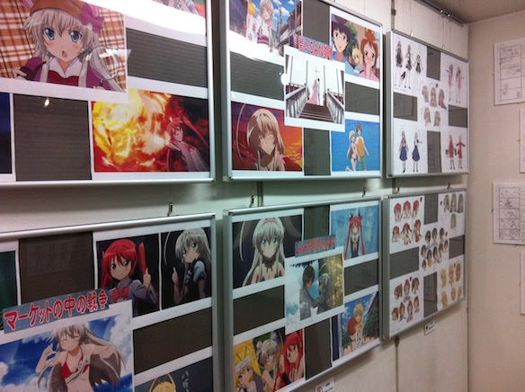
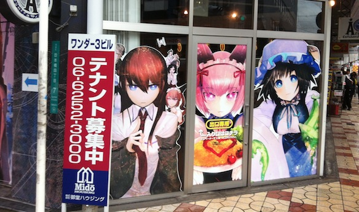
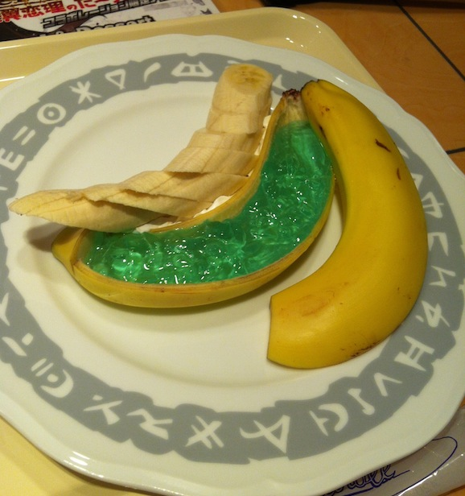

Im in Japaaaannnn yaaaaay!!! Met up with [Kosuke](http://twitter.com/SYORYU_sav_KOU) and [Tac](http://twitter.com/taccarin) at Nanba Station and we went around Nipponbashi.

---

The main reason to meet up at Osaka was to go to the Steins;Gate cafe!! It is located right in Nipponbashi and has been opened for the past 3 months. Today was the last day, good thing we made it!

We also went around all the awesome anime shops Nipponbashi has to offer! Plus we played some Jubeat, Street Fighter and Project Diva, yaay!

Gel Banana!!!

Full album here:

