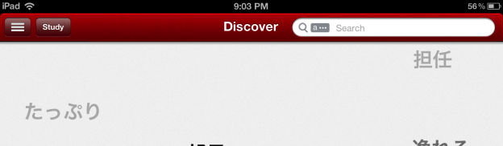

When I woke up today I was in for a surprise.

My favorite japanese dictionary application for the iPhone received a major long overdue update!

I have been using this app for over 2 years now and I love it. Very convinient Japanese dictionary. It sure beats buying a 300$ electronic Japanese dictionarry which would take a month to learn how to use.... And it has flash cards too!!

<!--more-->

This makes me want an iPad even more now :)

 
