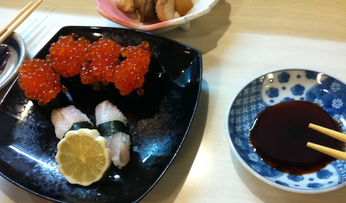
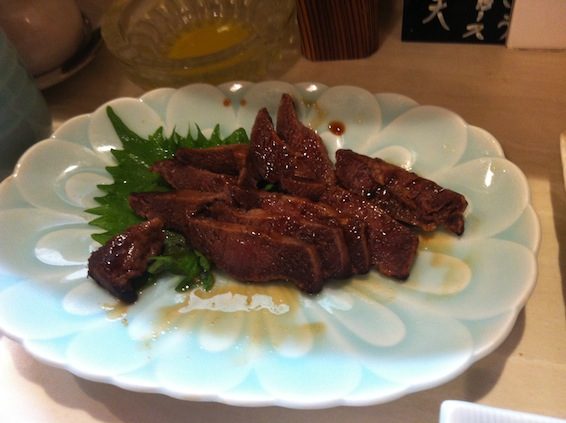
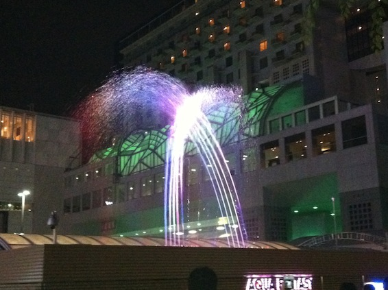
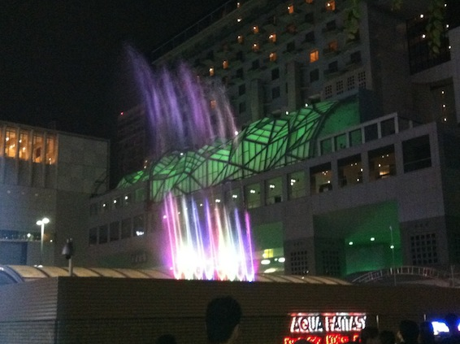

So today my friend Kosuke invited me over to Kyoto once again, this time to eat some real Japanese sushi. So 3 things happened: Street fighter competition, playing Street Fighter with Kosuke, and eating delicious sushi with Kosuke and his father.

---We wanted to play some games, so we went to the biggest arcade in Kyoto. As it turned out there was a 3v3 Super Street Fighter IV competition happening there. We were very exited about that, so we decided to stay there and look at the all the games up until the finals. Wow, the level of play was amazing, some of the strongest people of western japan have gathered in that arcade in Kyoto. There were the #1 #5 #8 #9 top players of Osaka, #1 #4 top players of Kyoto, #1 top player from Nara and #1 of Wakayama. And in the finals we got to see a suburb victory by no other than Uryo (Sakura). The best sakura in japan, he competed in EVO 2012 and is now back in japan is still winning.

Then after spending 3 hours in a Namco arcade playing SF with randoms and Kosuke, we finally got hurry and went to the sushi place, where we met with Kosukes father. A real Japanse shop (restaurant) is not like one of those sushi train places, its looks like an bar and you order the sushi which you want to eat. All the different types of sushi are listed on a parchment on the wall, all you have to do is shout out the name and in a minute you get a fresh pair of sushi on the table. What can I say, I've never seen so much fish in one place. I don't even know the names of half the fish that we had today (in japanese, english or russian). But they were delicious! However, the sushi were nothing compared to the special dish we had. Can you guess what it is:

If you said fried whale meat, you guessed right! That was a delicacy that used to be very common food in japan, but after the ban, its has become one of those foods you only eat at rare occasions. It was like nothing I have ever tasted before. Soft, gentle and then chewy. This was a once in a lifetime experience. Eating whale meat while drinking umeshuu (alcoholic beverage made from japans plum), this is the life of a poor australian university student XDDDDDDD

On our way back, we dropped by one more arcade and played some more Super Street Fighter IV. With Kosukes help, I have reached 10,000BP (battle points) and "B" rank. Its still a long way until I become a world warrior, but I will get there one step at a time!

Also there was some kind of cool fountain show in front of 京都駅:

Whole album:

