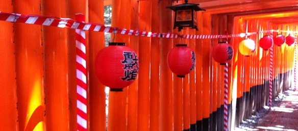
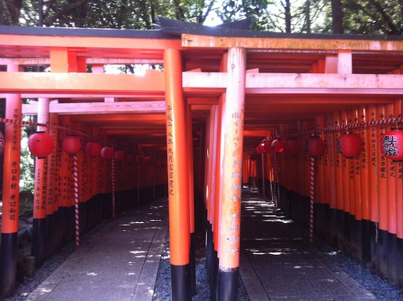
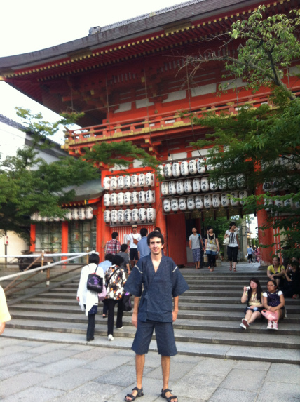

It was supposed to be just a normal sunday for me, until I decided to go hang out with my friend Kosuke in Kyoto. So I picked a random day (today, 15th of July, Sunday) decided on a time and went to Kyoto, where Kosuke was waiting for me. Little did i know what was in stall for me....

<!--more-->

So first off we went to a place called [Fushimi Inari-taisha](http://en.wikipedia.org/wiki/Fushimi_Inari-taisha) (伏見稲荷大社), or as it is better know as: "the place with lots of orange gates". It was very hot (35°C), but we somehow managed to get up there, look around and take some pictures:

A weird coincident accused at that temple. When we were leaving, I saw 4 foreigners walking into the temple, then I realized that 2 of them were the russian girls from my class in Ark Academy (japanese language school). So I went and said hi. They were so shocked to see me there that the even said that all of japan is like a small town where anyone can meet anyone easily.

After that we went to some arcades and played some good'ol Street Fighter. Got some points, and got a better understanding of how to fight against Rufus, oh how i hate Rufus.....

Anyway back to the real world. So after spending an hour or so in the arcade, we went out and saw this huuuuuuge number of people gathering, for what apparently is the [Gion Matsuri (祇園祭)](http://en.wikipedia.org/wiki/Gion_Matsuri). Its this huge festival in Kyoto with take place through out all of July. Well in order to enjoy a real japanese festival to the fullest, and to avoid the scorching heat, I went and bought a [Jinbei (甚平)](http://en.wikipedia.org/wiki/Jinbei).

 It was rather cheap, only 2100円. It saved my life during this festival, cause walking through that huge crowd would have been too hot in normal clothes. I'm also planning to wear the Jinbei when I go the Tanjin Matsuri in Osaka on the 25th of July.

Here is a video of a guy painting a painting..... that sounds kinda weird, but i have no idea how to explain it in more detail....

<iframe src="//www.youtube.com/embed/OiGM4YdVBis" width="560" height="315" frameborder="0" allowfullscreen="allowfullscreen"></iframe>

So once we walked around for a good 3 hours, it was time for dinner. Kosukes father came along and we went to have some shabu shabu. It was delicious to say the least. Also Kosukes dad is a very nice person, we managed to talk a lot about the difference in cultures, my study and overall life in Australia. I was also treated to some [Umeshu](http://en.wikipedia.org/wiki/Umeshu), which great as well.

Aaaaaand here is a gallery of today mini trip to Kyoto:

