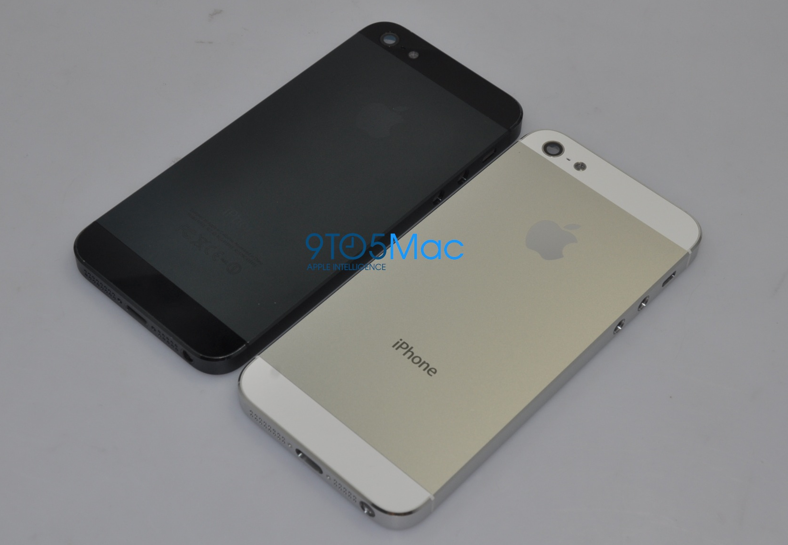

Everybody is curious as to what the next iPhone will look like!

Well the nice folk over from [9to5Mac.com](http://9to5mac.com/2012/05/29/photos-black-and-white-next-generation-metal-iphone-backs-mini-dock-taller-screen-moved-earphone-jack-present/) has acquired some interesting images that portray the design of the next generation device.

As can be seen on the photo the new iPhones will have a aluminum back cover (yay! no more fragile glass). Also they seem to have a new type of dock connector.

Not to sure how apple plans on changing the dock connector when we are all used to the 30pin one..... Some people speculate that it is in order to make room for bigger and better speakers and microphone.

Another thing to note is that the headphone jack has been moved to the bottom, so now its the same as the iPod touch.

Furthermore the size of the device is slightly bigger, the screen being 4inches instead of 3,5 on the current iPhone.

Anyway, it looks awesome, and i can't wait to get my hands on this beautiful device!
