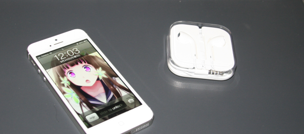
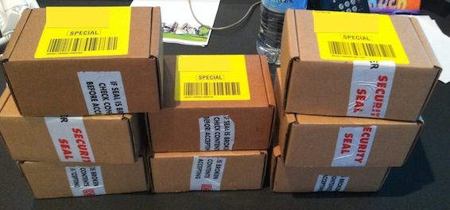
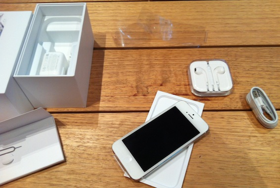

You all know about the iPhone 5. You have probably heard how people are disappointed with it. Some of you might even think that its not that good. Some of you have read blog posts about how its easily scratchable and breakable. Some of you maybe even heard bad things about iOS6. Well let me tell you what I think. Let me tell you MY experience with the amazing new iPhone 5.

---

**Friday 12pm:**

 Urbanest receive 8 iPhones. And of course my new iPhone 5 is there. I get my box, and start the whole epic unboxing process. First I throw out the brown cardboard box. Then I proceed to open up the pure white iPhone 5 box and there I see me beautiful new toy. Its just gorgeous! Inside the box was the new Lightning cable and the new EarPods, plus of course the manual and apple stickers.

Well now my actual impressions. My old phone was an iPhone 4 which I bought in october 2010. It has been my faithful companion for almost 2 years now. But alas its time has come.

First off I want to say that it feels like a toy in your hand. It is so light that you don't even feel that that is a phone in your hand. The aluminum back feels really nice to touch and hold and the 4" display doesn't feel that much different from the 3.5". I definitely like the pure aluminum on the back of my white iPhone 5. It looks as elegant as my Macs. I have a feeling that they improved the speakers cause it sounds louder than my iPhone4 when I play music.

I can not describe how much faster the iPhone 5 feels in comparison to the iPhone 4. All the apps launch instantaneously, hell even when I restarted it, it only took 10 seconds to do it. Not only do the apps feel amazingly fast, but also 4G LTE allows much better speeds now. I did a speed test. The bottom values are on Telstra 3G, middle is my home Wifi with BigAir and top is Telstra LTE. Compare the speeds!

Overall I am very satisfied with my new iPhone. I am gonna enjoy using it/playing with it every day. As per tradition I name my apple devices as my favorite anime characters. So I dub thee iChitanda.

Posted from my iPhone5.
