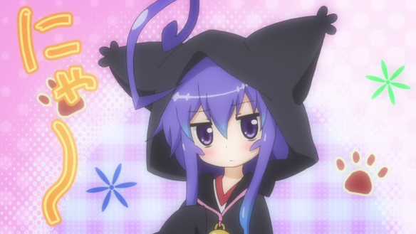

俺のつみきがこんなに可愛いわけがない

In every episode of [Acchi Kocchi (あっちこっち)](http://myanimelist.net/anime/12291/Acchi_Kocchi) they make Tsumiki make the cutest facial expressions and wear the cutest things!

Well episode 9 was no exception! Feist you eyes on this 140cm (not 100% sure, no info on her height yet, will research) tall purple haired girl wearing a cat costume!

The reason she is dressed up like that is because, their class is making a crepe stall for the culture festival and Tsumiki will be the mascot. And since everything is this anime is cat themed - nyan (Tsumiki being the main cat), they just had to make hear wear a cat hoodie, HNNNNGGGGGGG

Anyway back to watching the episode!
