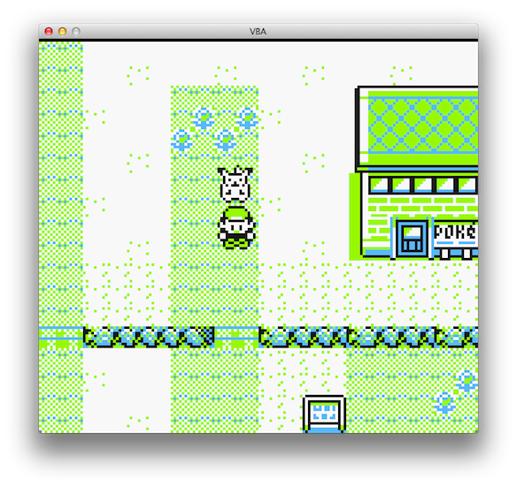
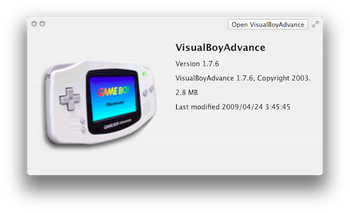
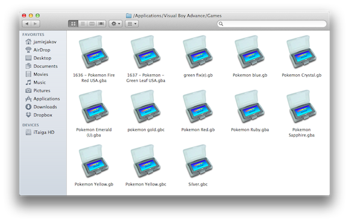

Because of all this talk about Pokemon in the [Anime@UTS](http://utsanime.net/ 'Anime @ UTS') club lately, I fell into nostalgia mode and decided to replay some of the classics.

In order to do that though, one either need a Game Boy / Color / Advanced / Nintendo DS.  In my case I have a Game Boy Advanced, however i do not posses any of the Pokemon games.... sadface.jpg

So what does an IT guy do in this case, one thing! find an emulator. And I was successful. Now I can play any Game Boy games on my iTaiga (MacBook Air) or iKonata (Mac Mini). 1 ROM is usually 1-20MB and they provide infinite enjoyment!

---

It was no easy task however. There are heaps of GBA emulators; for Windows......... and 2 for Mac, both of which do not work because of OSX 10.7 Lion. But after much searching I found a remake of the GBA emulator, made to work with Lion:

This little app allows me to play any kind of GB/C/A games! And it also adds these nice icons to .gb .gba .gbc file formats.

