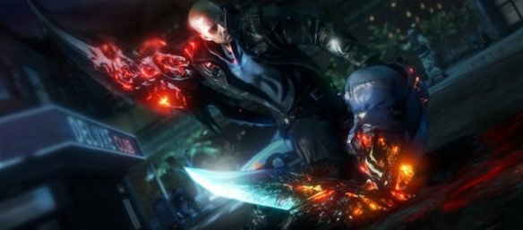
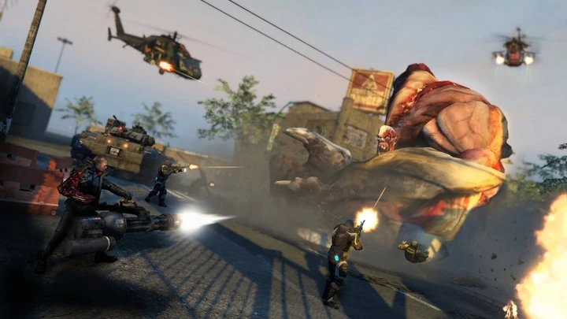

Now that I am free from studying, exams and all this other stuff that had to be done, I finally finished Prototype 2. Generally the game was good, not as good as expected and definitely not as good as the first one.

<!--more-->

Here is a the trailer for those who don't know what it is all about:

<iframe src="//www.youtube.com/embed/CZ5xW-Yo720" height="315" width="560" allowfullscreen frameborder="0"></iframe>

So what I liked about the game:

It had everything that I loved about the original Prototype:

- Alex Mercer
- evolved abilities: claws, tendrils, shield, etc
- the blade is as awesome
- flying looooooooooooong distances
- killing heaps of innocent people and consuming them to regain your health
- beating huge monsters

New stuff that was awesome:

- bigger monsters; HOLY F\*\*\*ing SH\*\*

- nicer looking claws and blade
- i found it awesome that they got rid of the annoying "destroy hive" and "capture military base" side missions
- upgrades to everything!
- no more useless abilities like the shell (or armor or whatever its called)
- new _evolved_ monsters
- last boss actually felt like a last boss, unlike in the original where the boss before last was harder than the last colonel dude.

Thats a very nice update to the game me thinks. But unfortunately the gameplay and the protagonist are not as great....

Things I didn't like:

- James Heller: he never felt like a character that we were supposed to love... Alex Mercer had an epic backstory and we were supporting him all the way through the original Prototype. Alex took on the world and won! Heller on the other hand is presented a soldier who lost his wife and daughter and then Mercer shares his superpowers with Heller. Starting there James starts to realize the truth and goes agains his maker and in the end defeats him. Also all the clips (cinematics) during the game did not make us like Heller even one bit.... All he had on his mind was: "destroy Mercer" and "save Maya (his daughter)" .
- Alex Mercer as the bad guy: Alex was one of the best parts about Prototype, he had a good cause and we played it out well. Here he is presented as this evil mastermind who wants kill off all humans and create this race of evolved, who will have the same DNA as him. They will not have conflict, they will not fear, they will be immune to disease, they will be immortal. That just annoyed me, how Alex turned into this self obsessed a\*\*hole who wants to take over the world.
- gameplay: repetitive missions get repetitive, relatively fast to get through the game (I played on hard). Hard is not hard (well not for me anyway).  Once you get the pattern of the monsters attacks, you find really easy ways to kill them and I barely lose any health.

All in all it was a enjoyable game, would definitely recommend it to people who played the first one, and if you haven't, GO PLAY NOW!

If I had to rate this I'd give it a 7 out of 10 to be honest.
