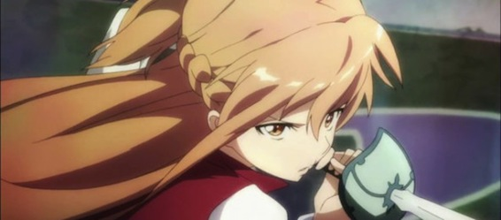
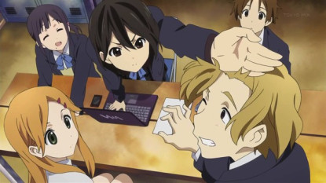

Summer 2012 anime season has started and is already in full swing! The people at TheAkiba.com have compiled a nice list of "must watch" anime this season (with a description of why they like each series).

Personally I'm watching 6 new things this season and 1 from last season.

---

- Yuru Yuri II
- Sword Art Online
- Kono Naka ni Hitori Imouto ga Iru
- Kokoro Connect
- Jinrui wa Suitai shimashita
- Dakara Boku wa H ga Dekinai
- Hyouka

(please click the picture to proceed to TheAkiba website)

