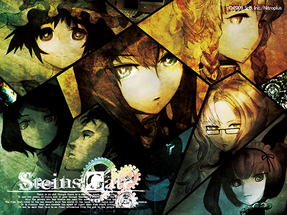
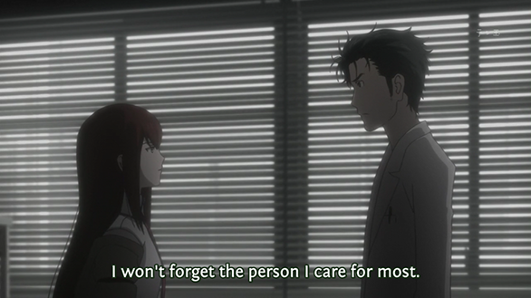

Copying another old review of mine from Google+.

This time I Bring you [Steins;Gate](http://myanimelist.net/anime/9253/Steins;Gate):

Best time travel related story ever! **10/10**

Overall the story had everything: fiction, comedy, drama, romance, even a tsundere XD the plot was deep and i could not find any continuity errors (i tried hard, really) while they were time traveling.

<!--more-->

The characters are my age and are easy to relate to. They have the same interests (anime/game otaku), that is why they seem close to me. Usually the characters of popular anime are high schoolers, its quite rare to see an anime with Uni age people. But i liked a lot that Hoooooooooorin Kyouma is 18 and Christine (Kurisu-chan) is as well. Most importantly i like the language they used (in japanese), the internet slang, the japanese memes (which Commie subs translated to english memes XDD). Thats why i not only listened to the story but also listened as much as i could to every word they were saying, in order to learn and use.

I feel like an idiot for not watching this while it was coming out (even though [Shihou Kou](https://plus.google.com/101745807649248073863) told me it was veeeeeeery good, i didn't listen). But i got to watch it all in 2 days and that makes me happy.

To everyone who hasn't seen it, YOU MUST WATCH!

