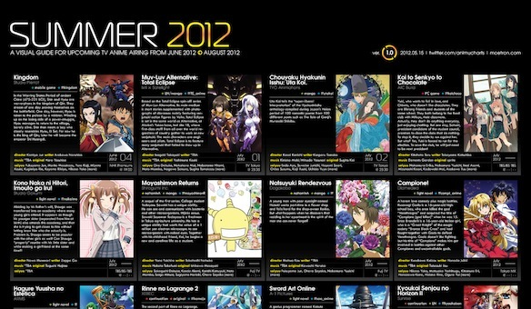

So here it is: the summer anime list.

It is by far not the final version, but lest just see what good things i will be watching next season.

Soooooooooo this is the stuff ill be watching in summer:

1. _[Koi to Senkyou to Chocolate](http://myanimelist.net/anime/12175/Koi_to_Senkyo_to_Chocolate "Koi to Choko")_: this seems like the K-ON kind of slice of life, where nothing happens, just cute girls doing cute things, we shall see what it turns into.
2. _[Kono naka ni Hitori, Imouto ga Iru (NakaImo)](http://myanimelist.net/anime/13367/Kono_Naka_ni_Hitori_Imouto_ga_Iru! "NakaImo")_: ok! this has an Imouto and the name is as long as OreImo so it should be good!
3. _[Ebiten: Kouritsu Ebisugawa Koukou Tenmonbu](http://myanimelist.net/anime/14073/Ebiten:_Kouritsu_Ebisugawa_Koukou_Tenmonbu "Ebiten")_: made by same people as Seitokai no Ichizon, should be good
4. _[Dakara boku wa H ga dekinai](http://myanimelist.net/anime/12549/Dakara_Boku_wa_H_ga_Dekinai. "HgaDekin")_: made by people who made Yosuga no Sora and Mayo Chiki; lots of ecchi, will watch
5. _[Kokoro Connect](http://myanimelist.net/anime/11887/Kokoro_Connect "Kokoro")_ looks just like K-ON (art wise) must watch!
6. _[Yuru Yuri ♪♪](http://myanimelist.net/anime/12403/Yuru_Yuri_♪♪)_ is a must watch!

There are some good movies coming out as well and ill be able to watch [Ookami kodomo no Ame to Yuki](http://myanimelist.net/anime/12355/Ookami_Kodomo_no_Ame_to_Yuki) , yaaay I'm happy!

Here is the full list, click the image for the larger version.

