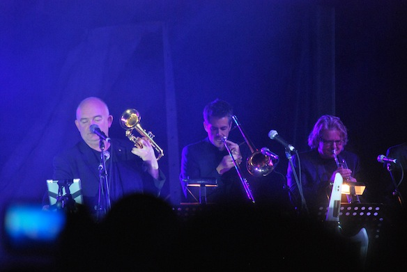

Photo by [Rubenerd](http://rubenerd.com/james-morrison-2012/) (he has more good pics).

9th - 11th of June there is a Jazz and Blues festival happening in Darling Harbour Sydney. So yesterday we decided to go look around and listen to some music. We includes [@Rubenerd](http://rubenerd.com), [@Sebasu_tan](http://alonelyseptember.org/), [@hanezawakirika](http://twitter.com/hanezawakirika), [@adasifs](http://twitter.com/adasifs), [@Keodara\_](http://twitter.com/@Keodara_), [@alchmyest](http://twitter.com/alchmyest) and me [@jamiejakov](http://twitter.com/jamiejakov).

At first we met up at the UTS tower at 3:30 and just went towards Darling Harbour, where we listened to Kira Puru & the Bruise fro about 30 mins. Then we got Ruben a hot cup of coffee to keep him warm and went under the big tent to watch the last performance of the day.

<!--more-->

James Morrison, an Australian music legend, live on stage! It was marvelous. Here are 3 videos that i managed to film with my iPhone.

<iframe src="//www.youtube.com/embed/OGI3_PaK-lU" width="560" height="315" frameborder="0" allowfullscreen="allowfullscreen"></iframe>

<iframe src="//www.youtube.com/embed/9zDFRq3WF9I" width="560" height="315" frameborder="0" allowfullscreen="allowfullscreen"></iframe>

<iframe src="//www.youtube.com/embed/uy9_vSh-2WA" width="560" height="315" frameborder="0" allowfullscreen="allowfullscreen"></iframe>

Also here are some quotes that James Morrison said in between the pieces:

- “What kind of music we playing now? HALF shuffle?! Screw that, we do nothing HALF here!”
- James Morrison telling us how to defrag all our keytars to boot faster!
- Jazz, it’s cooler than indie!
- You make me feeeeeeel! Like a naaaatural woman!
- Everything, EVERYTHING is on YouTube within 10 minutes now, I’ve learned!
- If anyone has a trumpet, a horn, you have to play it along with us. Guess we should have told you to bring it!
