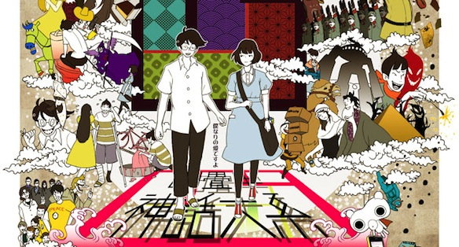
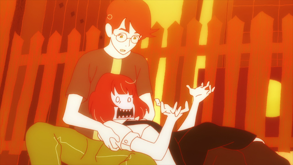

[Tatami Galaxy (四畳半神話大系)](http://myanimelist.net/anime/7785/Yojouhan_Shinwa_Taikei) - an anime worthy of being called a classic! It is hard to describe the genre for this particular anime, but I'm guessing it would fall under the random / life / mystery. Even though it was only 11 episodes long, it is definitely a must watch for all anime lovers.

**If you wish to continue reading, be warned that a lot of SPOILERS await!**

<!--more-->

The story is about a college dropout (he has no name, he just refers to himself as Watashi (me in japanese) during the whole series, cause he is the narrator), who, after meeting a certain person at a ramen shop, has to re-live his 2-3 years of college in various manifestations. In each "dimension" he joins a different club (circle) in uni and therefore the way he interacts with the other characters alters episode by episode. But in every variation he is destined to meet Ozu, a sly looking fellow who was always seeking to cause trouble. The MC (main character) a Ozu always end up becoming good friends, even though MC hates Ozus guts. There are other characters like Ozus master Higuchi, the doll lover Jougasaki, the fortune teller which raises the price for giving advice to MC in every episode (starting at 1000Yen and hoing up to 9000Yen), and of course the lovely Akashi, who MC is head over heals for (in most dimensions).

Oh yea, this is a romance story! Riiiiight, I almost forgot about that..... THe romance between MC and Akashi is obvious yet hidden. When all the dimensions come clashing in the end they do get their happy end though.

It reminded me a lot of the Endless Eight from Haruhi. But unlike that, the episodes in Tatami Galaxy had more differences in the story/characters involved. In the end it was all worth it. The last 2 episodes were pure epic. The whole series, all the different dimensions were building up to the last to episodes.

Overall this series had solid characters, a very interesting plot, unique art style and awesome OP and ED (they are in my top AniSong playlist).

Rating: **9/10**

<iframe src="//www.youtube.com/embed/VyYCYd2wHY4" height="315" width="560" allowfullscreen frameborder="0"></iframe>
