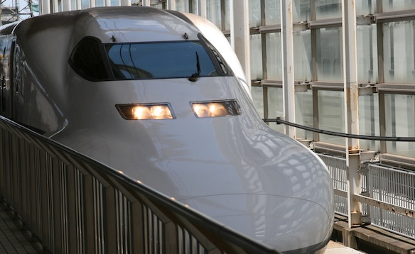
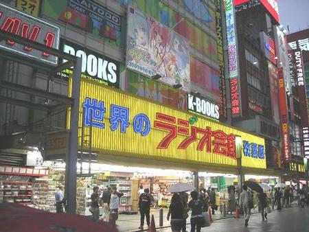

My friend Kosuke and I went to Tokyo for 3 days.

So we took the Shinkansen from Kyoto to Tokyo. It was awesome!

<!--more-->I wanted to take a picture of Fujisan, but unfortunately there were so many clouds that i could even see the mountain, let alone take a pic....

Once we got here, we were planing on going up on the Sky Tree, but since it only opened in May, we couldn't get any tickets, everything was booked out... We should have pre booked a week beforehand :(

We still went there, looked at it from the bottom and took some awesome pics!

Then we went to Asakusa and look at an old temple. Got pics of that as well.

After having nowhere else to go, we decided to go to 聖地 (holy land) of all us オタク - 秋葉原 (Akihabara). When I saw it, my heart started racing! Soo much anime in such a small space. I was a little disappointed though. I had imagined that it will be this huuuuuge place with like hundreds of stores, but it was pretty small in size, compared to the widespread Nipponbashi in Osaka. It is still a very amazing sight to see. With big 6 story buildings which are dedicated to selling anime related goods, 5 or 6 arcades and even a huge [Yodobashi Akiba](http://en.wikipedia.org/wiki/Yodobashi_Camera) store.

So tomorrow I will be spending the whole day there, looking at anime stuff, buying figs and playing Street Fighter, jubeat and Project Diva. Also it was kinda sad to see this famous place had been demolished and a new building is being built:

Full album here:

