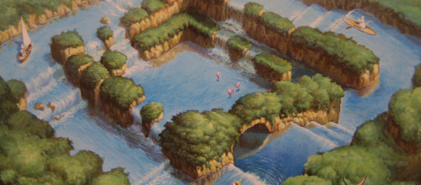

Today was the last time in the next 2 years (probably) that I saw one of my best friends: Kosuke. We went to [Osaka Dome](http://en.wikipedia.org/wiki/Osaka_Dome) where there is a quite an interesting exhibition happening. In japanese they call it Trick Art, basically optical illusions.

Paintings drawn on walls, but with parts of the body sticking out of the frame, making it look like they are 3D. It was a lot of fun. Here are some awesome pics:

