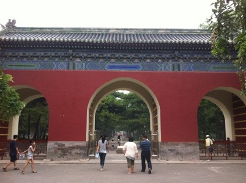
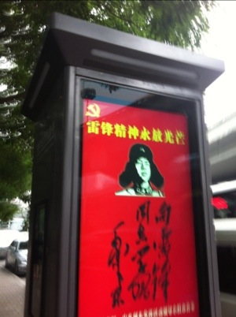
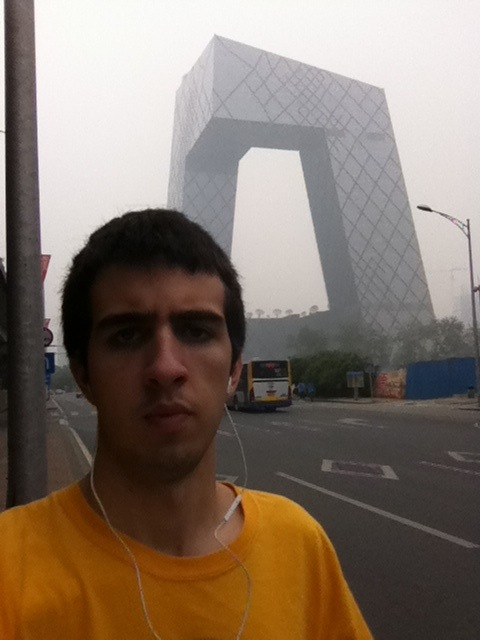
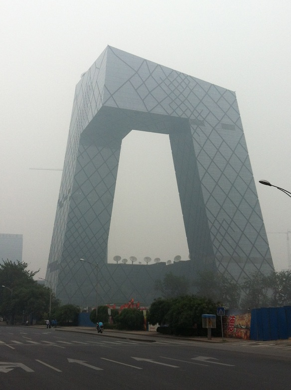
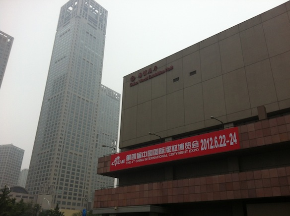

After a good nights sleep and a solid breakfast (fried rice with bacon and fruit) i decided to wander around town cause my parents will obly arive at 3pm today.

<!--more-->

Then i found this sign:

 I have no idea what it says, but it has a communism sign on it!

Then I found this place, the new CCTV station:

Unfortunately the weather isnt all that great, its very cloudy and quite humid. But on the other hand, its not hot!

While i was walking around I managed to find a McDonalds, 2 Starbuckes, and a Subway. Also I sonehow managed to end up in the russian shoping district... Also i went down into the city subway (underground/ metro) and aparently you need to goo through a bag inspection, just like the one in airports, in order to get to the tracks; weird, ain't it?

Some french people asked me where the post office was and i didnt know, so helpless :( sadface

My expectations of beijing were completely different, i thought it was sonething like we see in movies, but it turned out to be this big, clean and beautifull city! Im impressed

I found this to be pretty funny (read the sign):

"China International Copyright Expo"
