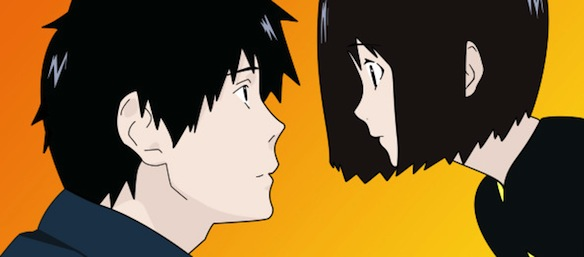

So I just finished the anime [Welcome to NHK](http://en.wikipedia.org/wiki/Welcome_to_the_N.H.K.) ([NHKにようこそ！](http://ja.wikipedia.org/wiki/NHKにようこそ!)).  It was as good as expected. However when I started watching, my expectations rose. The series is what I needed right now to show me what to look after and who not to become :S

---It is a story of a collage drop-out NEET [hikikomori](http://en.wikipedia.org/wiki/Hikikomori) "living" in an apartment in Tokyo. He thinks that everything happening in his life is due to a conspiracy made by the NHK (Nihon Hikikomori Kyoukai). Then one day he meets Misaki, a cute 18 year old girl, who's life is almost as bad as his, who decides to help him cure his hikkikomori-ness. Then he meets an anime otaku, also his junior in high school, Yamazaki who coincidentally lives right next to his apartment ~purin.

 

<iframe src="//www.youtube.com/embed/tg8Jahz6RM4" height="315" width="420" allowfullscreen frameborder="0"></iframe>

Overall I really enjoyed the show! The characters were solid, the plot was consistent and the art was ok for a 2006 anime. What let me down a little was that there was a little too much depression for me. I do understand that its a important aspect of the show, but id like to see a happier conclusion....

I will give it a very strong **8 (out of 10)**.
