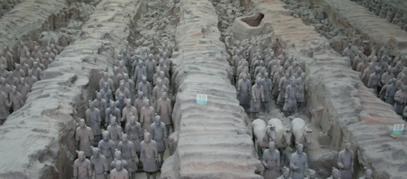
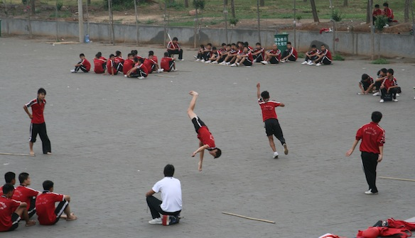

**DAY 5:**

After a 9 hour train ride from Beijing we arrived at the old capital of China - Xi'an.

---This is the place with the world famous [Terracotta Army](http://en.wikipedia.org/wiki/Terracotta_Army). Hundreds of thousands of statues of warriors carved out of clay and put underground if front of the burial place of the first emperor. The first Chinese emperor strongly believed in the afterlife, so he made the people build him this huge army, so that they would protect him when he passes away. It was a crazy idea, and it took them over 30 years to make all of these warriors, but it was done. And then it was buried underground so that no one would ever find them. But in the 20th century a farmer was digging a well and stumbled upon this "army".

In general Xi'an is dirtier and rowdier than Beijing. How should I put it, its more of what I expected of china. Beijing was more like Russia/Ukraine (Moscow/Kiev) - Nice new buildings, noisy and annoying people.

For dinner we had some cute bird, pig, fish shaped dumplings (pics bellow).

**DAY 6:**

Bullet train to LuoYang. Saw some caves with carved Budas there. Aparently a small city in China is 2mil people... Well the population of Latvia is 2mil.....

**DAY 7:**

Shaolin Monastery and temple. Hundreds of kids practicing Kung Fu. They look awesome! Just like in Kung Fu Panda XDD

We even got to see a small performance. Those kids did some unbelievable stuff. Now I see why everyone is obsessed by Kung Fu (cause its awesome). Everyone being the movie and gaming industry (yes I am looking at you Blizzard... Mists of Pandaria....)

Well that basically concludes my journey to China. Now I'm in Japan and will blog about all the awesome stuff I see and experience on this island.

PS. More pics:

