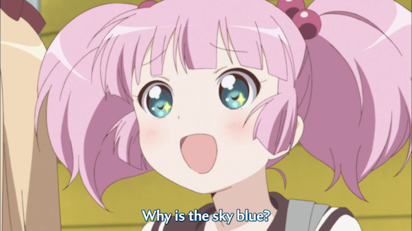

So I was watching [Yuru Yuri ♪♪](http://myanimelist.net/anime/12403/Yuru_Yuri_♪♪) and then this randomly appeared..... It reminded me a lot of my high school physics teacher Shepelev.

Вообщем во время просмотра аниме [Yuru Yuri ♪♪](http://myanimelist.net/anime/12403/Yuru_Yuri_♪♪) появилась вот такая сценка..... Она мне очень силно напомнила нашего любимого учителя физики из 10й Рижской средней школы - Шепелев. Когда она показала систему координат, я сразу подумал о Шепелеве, а потом еще и вопрос почему небо голубое! Сразу вспомнил уроки физики XD

---

