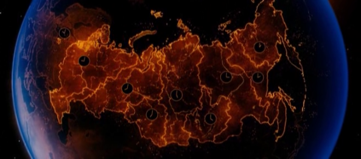
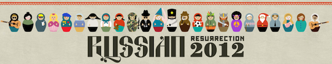

С 30го Августа по 12 сентября в Сиднее проходит [фестиваль русского кино](http://russianresurrection.com/2012). Когда мои друзья меня уведомили об этом мероприятии, я был весьма заинтересован. 

---

Фильмы представленные на фестивале:

- Жила была баба (2011)
- Сибирь монамур (2011)
- Два дня (2011)
- Пять невесь (2011)
- Елки 2 (2011)
- Мой парень ангел (2011)
- Высоцкий. Спасибо что ты живой. (2011)
- Искупление (2012)
- Поклонница (2012)
- Шпион (2012)
- Громозека (2011)
- Август.Восьмое (2012)
- Дом (2011)
- Белый тигр (2012)
- Орда (2012)
- Иван царевич и серый волк (2012)
- Матч (2012)

А так же:

- Война и Мир (1967)
- 1812 (1912)
- Эскадрон гусар летучих (1982)
- Плохой, хороший человек (1973)
- Неоконченная пьеса для механического пианино (1977)

Из перечисленных фильмов, мне посоветовали посмотреть "Елки 2". Это семейная комедия про новогодние приключения 7 разных людей в разных частях матушки России, и их все связывает одно - теория шести рукопожатий. У человека есть знакомый, а у знакомого есть другой знакомый, и.т.д. Таким образом можно передать послание от ребенка в детдоме до президента Российской Федерации.

Фильм был интересный, с очень хорошими шутками и различными приколами. Я был очень рад увидеть актера - [Головина Сашу](http://www.kino-teatr.ru/kino/acter/m/ros/1018/bio/), который играл Макарова из сериала "Кадетство". (Я считаю что сноубордисты круче!). После окончания фильма, я начал плакать (ну не совсем плакать, но слеза пробилась это точно) . Не из-за того что мне грустно или печально, а потому что я вспомнил как я проводил новые года в Риге с родителями (последний был 2 года назад 2009-10 новый год). Я переполнен эмоциями и воспоминаниями родины. Во мне первый раз за 2 года в Австралии пробилось чувство что я хочу вернуться домой, что я хочу быть частью этого русского общества со всеми его недостатками и приколами.

Теперь мне хочется посмотреть еще русских комедий, чтобы не забывать родину, а то мои увлечения Японией доведут то того что я и про свою собственную культуру забуду!
