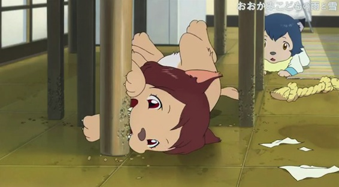
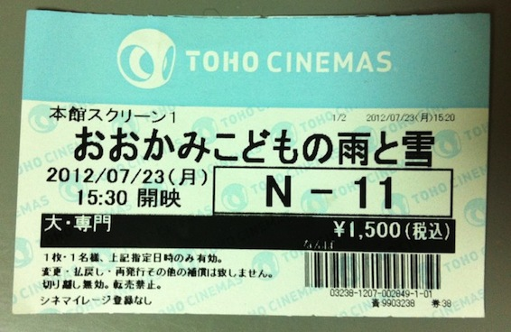

Today I went and watched [Ookami Kodomo no Ame to Yuki](http://myanimelist.net/anime/12355/Ookami_Kodomo_no_Ame_to_Yuki) in TOHO cinemas Namba (Osaka). I am so lucky that I got to see this movie while being here, in Japan. This movie is from the creator of The Girl Who Leaped Through Time and Summer Wars, Director Mamoru Hosoda. Knowing that, you must imagine the hype over this new movie.

---

It was a very, very, very good movie. So many heartwarming scenes.... Some even made me cry, cause they were so nice. And the music, the music was epic. The ookami kids were just so adorable. And the mother was a cute uni student in the beginning and then became a proper mother. I would love to go into more detail, but I don't want to spoil this awesome movie for anyone.

Here is a picture of the cinema ticket:

PS. To all my anime loving friends:  Have fun waiting 6 months for the BluRay releases XDDDDD
