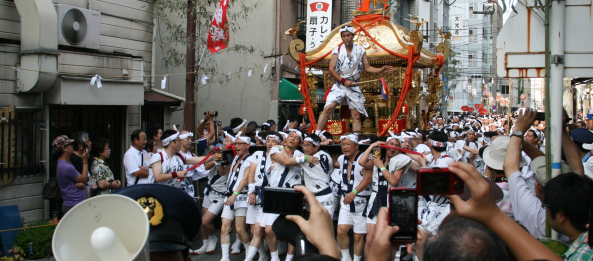

Yesterday (25th of July) was the day of the Tanjin Matsuri in Osaka. My classmates and I decided to go there and have fun.

Imagine a typical japanese festival with all the stalls and stuff and us walking in that huge bunch of people in the heat..... It was +32 over there, + the amount of people that gathered there wasn't really helping.....

<!--more-->

After walking around the stalls, eating and drinking, we went to look at the "parade" and went inside the temple. Then it was time for the fireworks. While waiting for the fireworks, I, being a diligent student, did all my homework for the next day ^\_^

Overall it was fun to go there with friends, but since I've been there 2 years ago, for me it wasn't really all that exciting..... But still worth it i guess ^\_^

Here are pics:

