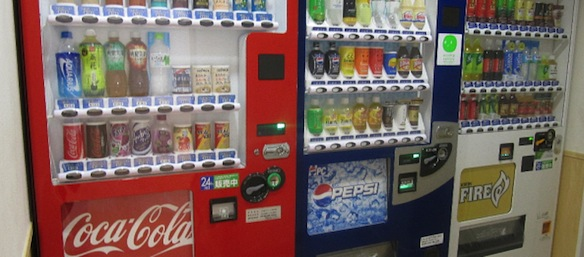
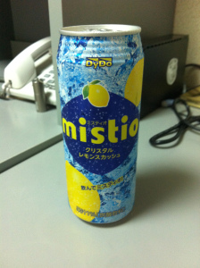
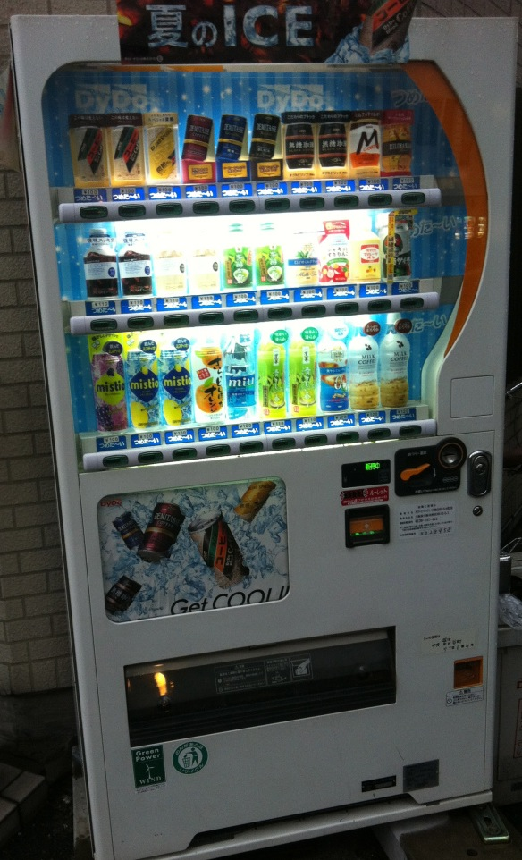

A marvel of japanese engineering and technology: the vending machine! These magnificent devices provide travelers with delicious thirst quenching nectar known as tea (or coffee).  Not only that, but in the land of the rising sun, these contraptions also hold cigarettes and alcohol. And the best part, that are everywhere!

---Literally you can find a jihanki (自販機) on the corner of every street, at the entrance to almost every building, inside the lobby of almost very building, etc... For example we have 2 machines in my dorm (ドーミー谷町), then across the road, 2 across the other road (the dorm is located on the corner of 2 reads), then 3 further down that road, 2 more the other way, etc..... Im at the stage when I know which jihanki sells what drinks and at what price, so I always take the rout with that one jihaki which has that one special drink at the lowest price. That drink is:

It used to be called Crystal Lemon, but now its called mistio. It is 100円 in that one special jihanki, 110円 or 120円 in other jihanki. Its a 500ml soda drink with the taste of lemon. Delicious, just delicious.

Back to the topic of vending machines. Not only do they sell you beverages, but some actually talk back to you! There is this one jihanki near my house which can talk, but not just talk in normal japanese, oh no. It talks in 関西弁 (Kansai dialect, Osaka accent). I find it so awesome! Here is a pic:

