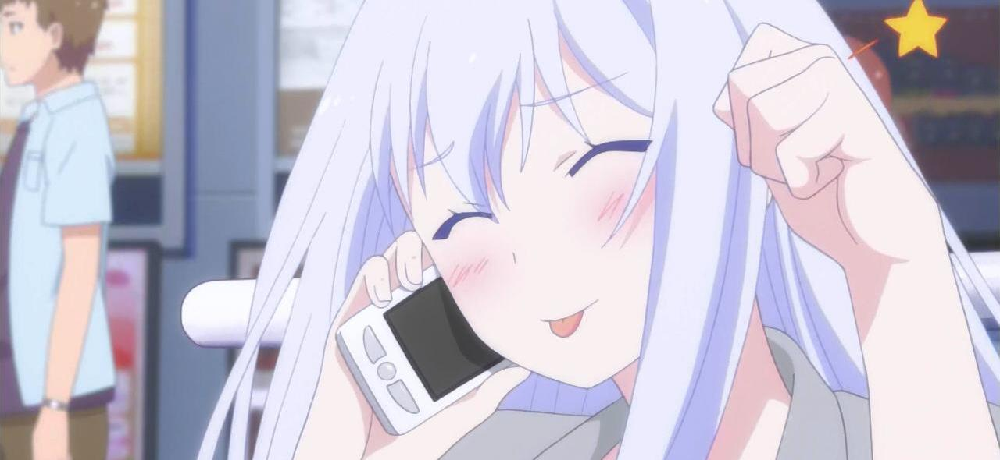
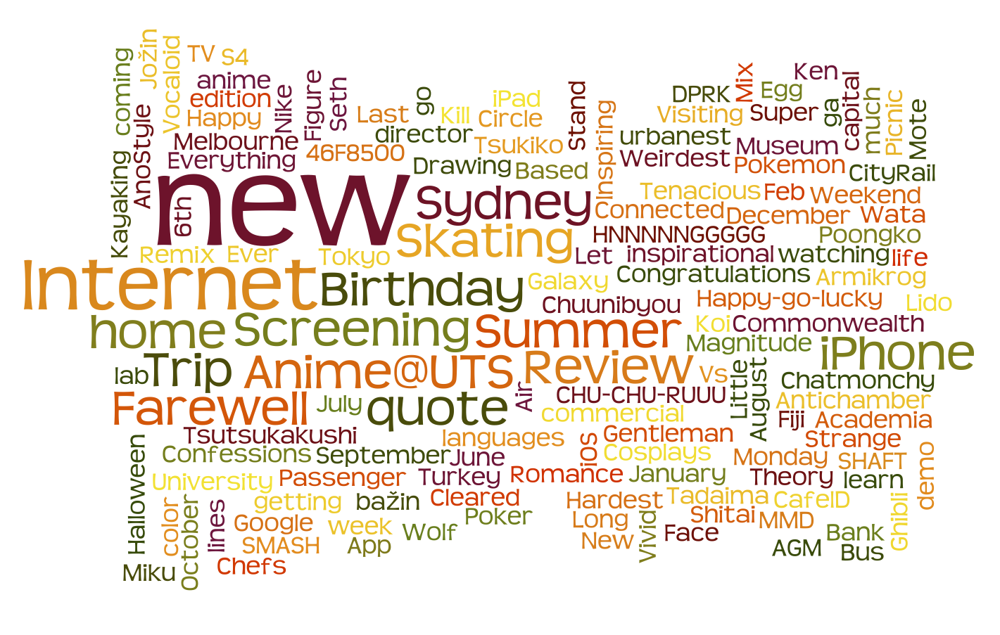

2013 is almost over, just a few hours left in this year, and I can say it was an amazing year. So much has happened in my life, so many things have changed and I continue to expand my skills and to improve on what I already have. Lets go over the events that happened so far.

For my birthday on the 1st of February my [parents got me a DSLR](/posts/2013/dlsr/) camera right before our trip to Melbourne to watch the Australian Open and Fiji. This sparked my interest in photography and I now I carry my camera to almost all important events.

---The next important event I would like to highlight is the the [Wolf Children screening](/posts/2013/wolf-children-screening-and-qa-with-the-director/) where I watched the movie for the 3rd time, but this time we got to see the Director - Mamoru Hosoda. He signed my BluRay copy of the movie and even drew me a sketch of Hana.

In May I got to see [Tenacious D preform](/posts/2013/tenacious-d-in-sydney/) live in the Syndey Opera House with [Sashin](http://twitter.com/sashin9000). That was my first time in the opera house and wow I can say that was amazing. The D will rise again.

And then I went home for a month in summer, [almost didn't make it](/posts/2013/what-a-long-strange-trip-its-been/), but it was ok in the end. Spent three weeks in Latvia, saw some of my friends, had some amazing food and overall had a nice rest from work and uni.

In December (on the 1st actually) I took the Japanese Language Proficiency Test and I really hope I passed. It was hard, harder then any other language test I have ever done. Why? Because of the Kanji of course. Kanji are my worst nightmare, I can sorta recognize them in text, but choosing the correct reading or the correct kanji based on a reading is not my strong point. Well results come out in March so I'll just have to wait till then.

Otherwise I played Pokemon Y, GTA V, The Last of Us, and of course I managed to clear Super Hexagon.

'twas a good year. Happy New Year! Lets have a good one again next year.

Thanks to [Ruben](http://rubenerd.com) I now know of this amazing website called [Wordle](http://www.wordle.net), which allows you to compile your most used words. So these are mine for 2013 based on archive titles.

