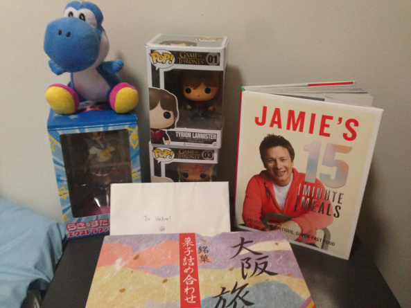

On the 1st of February at 11:38pm I turned 20. As usual my parents and I went traveling, this time to Melbourne and Fiji, thus I celebrated my birthday in a tropical style on Mana Island Fiji.

That was amazing and I can not thank my parents enough for always giving me these opportunities to see and experience different countries around the world.

But I also wanted to celebrate my birthday with my friends from university. So we went ice skating! Met up at central, went to Macquarie Shopping Center, had lunch there, waited for an hour..... then went onto the rink to skate.

So this years victims... \*cough\* guests were: [Mrs President Alex](http://twitter.com/maidforclass), [SurfingBird David](http://twitter.com/valtism), [CrazyCatLady Cindy](http://twitter.com/adasifs), [Dango Dalyna](http://twitter.com/Dal_chans), [Samurai Isaac](http://twitter.com/isaacsayshi), [Korean-chan Baek](http://twitter.com/BaeK88), [Muscle man Robbie](http://twitter.com/shirosenpai), [WaterMAN Sashin](http://twitter.com/sashin9000), [KingPotatoe Seb](http://twitter.com/sebasu_tan), and OrangeGuy me.

---

Some of us have skated before, some have done it once or twice, and for others it was their first time! We all had a lot of fun teaching each other some tricks, some even tried spinning, breaking and skating backwards. It was a very enjoyable afternoon.

https://www.youtube.com/watch?v=bTuLWO3RBV8

After a quick train ride back to central we went to KuraKura for dinner where we met up with Onigirikiri Clara, PythonOnRails Ruben (I just made that nickname up), and Cameraman Tac. What better way to finish of the day then having a nice japanese dinner, no? NO~! Off to my place we go, Bear Grills we watch! Whyyyy did we turn on the TV..... So we spent the evening watching Bear Grills survive in the desert by eating bugs and drinking his own.... well you know.

Thank you so much to all my friends who could make it to skating and dinner, I had an amazing day. Also thank you so much for all the presents!

(I hear that some are still on the way O.o).

