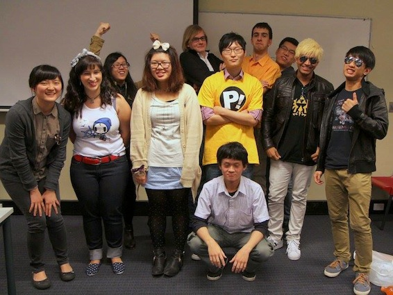

Remember [last year](/posts/2012/animeuts-agm-2012/) when I became the screenings director for the [UTS anime club](http://utsanime.net)? Well that just happened again! On the 5th of October we had our AGM and elected a new team for 2014. Our beloved president [Lexi](http://twitter.com/maidforclass) had to step down as he will be graduating next year, then our amazingly talented and hardworking secretary - [Clara](http://kirinyan.net/shit-happens/) ended up leaving our ranks as well, and also our 2 photographers, treasurer and vice have been replaced. I can say thank you for your hard work, and I hope to see you around.

Our new execs (going left to right):

- Grace - Arts Assistant
- Meig - Secretary
- [Cindy](http://twitter.com/adasifs) - Events Coordinator
- [Chloe](http://twitter.com/lottepon) - Arts Director
- [Ruben](http://rubenerd.com) - Webmaster
- [Baek](https://www.facebook.com/baek88?fref=ts) - President
- [Keo](http://twitter.com/keodara_) - General Relations
- [Me](http://twitter.com/jamiejakov) - Screenings Director
- [Tac](http://tacyip.com) - Photo/Videographer
- [Ravi](http://twitter.com/razorleaves) - Vice president
- Allan - Treasurer

Lets have an awesome year guys! I will be leaving for my exchange to Japan in April though, kukuku.

Visit the [official website](http://utsanime.net/2013/10/agm-results-2013/#more-3224) to read more about this meeting.
