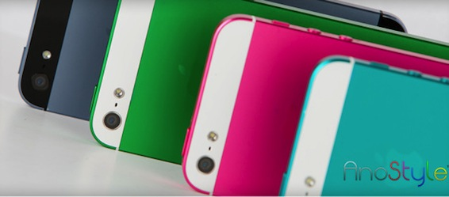
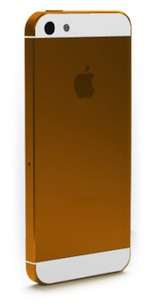

I was reading 9to5mac this morning when I saw a rather interesting article about a [golden colored iPhone](http://9to5mac.com/2013/02/26/hands-on-with-anostyle-gold-iphone-and-50-promo-code-photos/). I checked out the website, and WOW was I amazed! Those colors look so pretty on both the iPhones and iPad Minis, its just amazing.

How they do it is: they actually anodize the metal making it colorful. Its much more high quality then just simple paint or stickers and therefore the price is much higher as well. The price is 249$ which includes the fee for anodizing and the shipment of the phone to the US and back. 9to5mac is also offering a 50$ discount for the service if you enter their promo code.

To be honest, I AM SO TEMPTED to get this. It will make my iPhone so pretty and colorful! And you all obviously know what color I will go if I get this:

Here is the [link to the site](http://www.anostyle.com) if you guys want to check it out and if anyone has already done this, let me know how it went in the comments.
