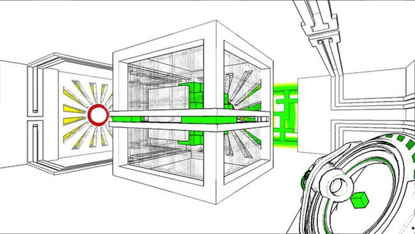

Today I finally finished this great game. Wow, just wow. I really love puzzle games and I can say this is a very high quality puzzle game. It makes you think out of the box (or should I say cube XD). I am talking of course about [Antichamber](http://www.antichamber-game.com).

---

You start off in a dark room wondering what you need to do. Then the sign says jump, so you jump! And you fall. In this game you cant die, your character doesn't have a health meter, you just walk around and solve these puzles and figure out where the hell do you have to go next. Seriously this game bends your mind. Say for example you have a choice go up or down, you go up and end up where you were then you naturally go down and end up in the same place again!

<iframe src="//www.youtube.com/embed/aGsnm2nOnso" height="315" width="560" allowfullscreen frameborder="0"></iframe>

Don't even try to understand the map, its impossible. Trying to figure out where to go next is hard, but a piece of advice: don't go seriously out of your way to get somewhere. If its near impossible, but requires you to build a bridge of blocks and it takes you more then 5 minutes to do it, stop thats the wrong way. If I had to compare it to anything, I'd say its a lot like Portal, but you dont have distinct levels and there is no GLaDOS leading you to cake.

To sum up this game will make your brain hurt, it is just that good. So if you have a PC I strongly recommend you get Antichamber on Steam now!

**9/10**
