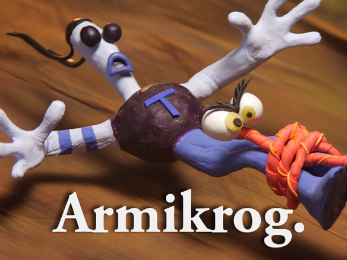

YOU HAVE NO IDEA HOW EXITED I AM!!!! This is like the sequel to one of my favorite childhood games: The Neverhood.

---

This is a new game made by Doug TenNapel and the creators of Neverhood, this game will be made Pencil Test Studios, a company made by these guys just for the purpose of making this game.

So if you have heard of the Neverhood (or НЕВЕРьвХУДо на русском), you are probably as excited as me right now. For those who don't, just look at this gameplay video: [click me!](http://www.youtube.com/watch?v=-7vqfy5cJG4&feature=youtu.be 'Neverhood gameplay') Not only is the gameplay pretty cool for a game made in 1996, but also the music is amazing, it is made by the award winning composer **Terry S. Taylor.** And guess what?! He is also composing the music for Armikrog, and from what I could see in the video on the [KickStarter](http://www.kickstarter.com/projects/1949537745/armikrog 'Armikrog KickStarter') campaign, the music is as funky as always. So if you don't know about this, download and play the game NOW! (Neverhood) and back up this project!!

<iframe src="http://www.kickstarter.com/projects/1949537745/armikrog/widget/video.html" height="360" width="480" frameborder="0"></iframe>
