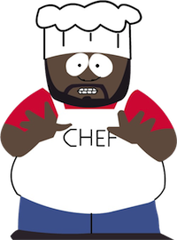

> Don't do drugs kids. There's a time and place for everything. It's called college.

\- Chef, [South Park](http://www.southparkstudios.com)

I love South Park and have seen all [237](http://en.wikipedia.org/wiki/List_of_South_Park_episodes) eps of all 16 seasons. And I remembered this quote (well only the second part, not the drugs part, but I couldn't leave that out cause one does not simply cut a quote in half) when talking to my friend. What I want to say is that: good things come to the ones who wait.
