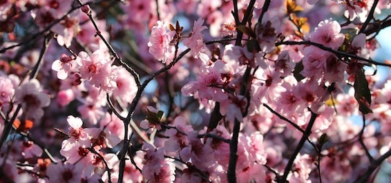
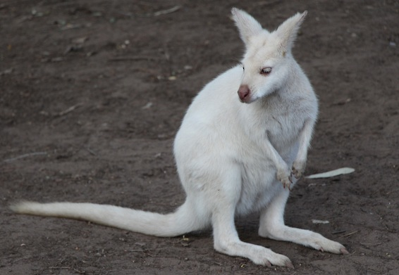

1 year ago my close friends [Cindy](http://twitter.com/adasifs) and [Sashin](http://sashinexists.com) organized an event to see the cherry blossoms in Auburn (and [I blogged about it](/posts/2012/cherry-blossom-picnic-2012/)). It was amazing, even though we were a bit late and most of the flowers have already finished blooming and had fallen, but we had lots of fun nevertheless. Well this year was even better!

---

[Tac](http://tacyip.com) picked me and [Saya](http://twitter.com/KSnpy) up from my place and drove us all the way to the gardens (thanks again man, really appreciate it!). We were the first ones there, so we got us a pretty good spot but with a very dirty BBQ. Since we are poor students we decided to clean it with water and tissues… That didn't go to well. But we somehow managed to get it cleaner and started cooking sausages. We had lots of food, and when I say lots, I mean lots, look at the pictures if you don't believe me (flickr link below). This year we managed to see some very beautiful trees and flowers and my good friend [Seb](http://alonelyseptember.org/cherry-blossoms-2013/) took some cool pictures of the animals which were there as well (he even managed to get a good shot of the peacock).

This year I didn't manage to get a group photo (I hope someone else did), but I have this:

Overall it was an amazing day. Thanks everyone for coming, I won't be in Australia for the 2014 picnic, but I hope you guys have a blast!

Here are some pics:

